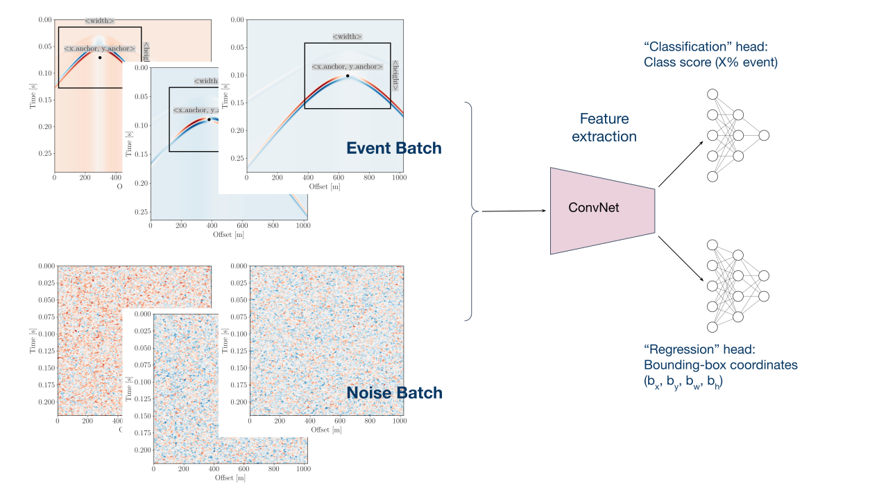

### Hi there, I'm Nima 👋

I'm a geophysicist with a focus on data science, deep learning and software development. I mainly write codes using Python, PyTorch and Bash, and currently learning Julia. Here is some of the stuff I enjoy doing:
- Time-series analysis
- Data visualisation
- Exploratory data analysis
- Bayesian statistics

📫 You can reach me at: nima.nooshiri@gmail.com

🔗 **I'm also on:**

  
  

---

<!--
**nimanzik/nimanzik** is a ✨ _special_ ✨ repository because its `README.md` (this file) appears on your GitHub profile.

Here are some ideas to get you started:

- 🔭 I’m currently working on ...
- 🌱 I’m currently learning ...
- 👯 I’m looking to collaborate on ...
- 🤔 I’m looking for help with ...
- 💬 Ask me about ...
- 📫 How to reach me: ...
- 😄 Pronouns: ...
- ⚡ Fun fact: ...
-->
